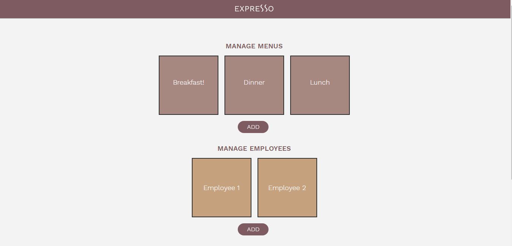
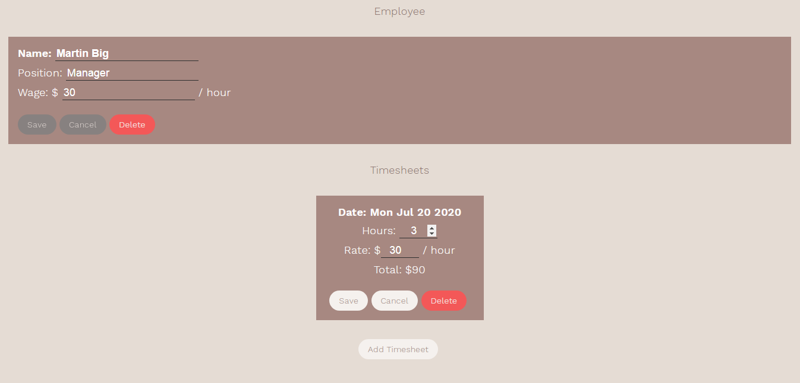
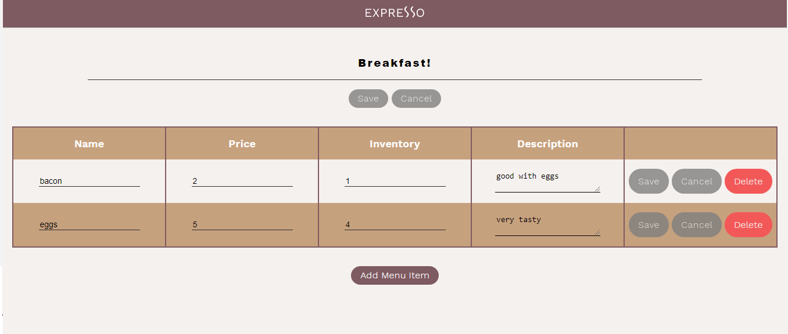

# Expresso

In this project, I built an app in Express with focus on the routing and database logic for an internal tool for a coffee shop called Expresso.

The Expresso internal tool allows users to:
- Create, view, update, and delete menus
- Create, view, update, and delete menu items
- Create, view, update, and delete employees
- Create, view, update, and delete employee's timesheets

The aim of this CodeCademy project was to create the database tables and required for the functionality API routes.

I implemented followinig steps:
- Create and export the Express app from a root-level file (*server.js*)
- Set a port argument for the server to listen on from ( process.env.PORT` || `4000`)
- Use the root-level *database.sqlite* as the API's database and set an optional database file argument from `process.env.TEST_DATABASE` in all Express route files that open and modify the database
- Create following database tables:
  Employee
  Timesheet
  Menu
  MenuItem
 -Create route paths (GET/POST/PUT/DELETE)

### Expresso Frontend

### Add Employee and a timesheet for him/her

### Change Menu or Menu item

